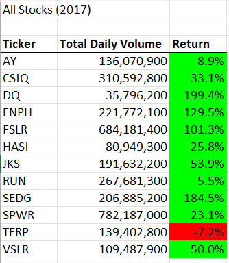
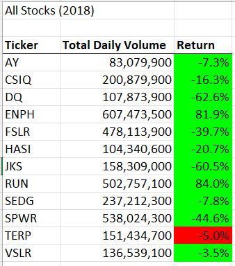
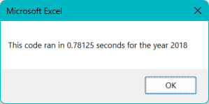
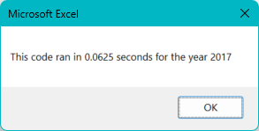
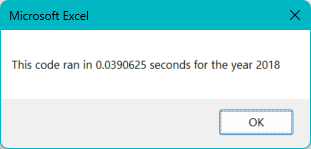

# Green Stocks Analysis

## Overview of Project
This stock analysis has been conducted to analyze the performance of several green energy stocks for the years of 2017 and 2018. The purpose for this analysis is to determine which green energy stocks are best to invest money, to get the best rate of return.

## Results
Below, images of two Stock Analysis Tables for the years 2017 and 2018, respectively, list stocks for twelve green energy corporations. There are three columns in the table, Ticker, Total Daily Volume, and Return. In the Return column, the stocks that earned a return are shown in green and the stocks that took a loss are shown in red.

#### Stock Analysis Table
According to the "All Stocks 2017" table, the best performing green energy stock with the highest rate of return is DQ, with a return rate of 199.4%. The stock with the lowest rate of return is TERP at a loss of -7.2%.

"All Stock 2018" table shows a very different outcome for the year of 2018. The stock with the highest rate of return is RUN, with a rate of 84.0%. The stock with the lowest rate of return is TERP at -5.0%

 

#### VBA Code Execution Time
The initial VBA code to conduct the Green Stock Analysis was created with the purpose of retrieve the information needed to make a decision, but was not time efficient in processing the code. The code for 2017 and 2018 took 0.84375 and 0.78125 seconds to process, respectively.

 

Refactoring the code enabled it to not only retrieve data but to retrieve data much faster than the original VBA code. The time for the refactored code to process for 2017 and 2018 took 0.0625 and 0.0390625 seconds, respectively. The processing time decreased by 0.78125 for 2017 and 0.7421875 for 2018.

 

## Summary
Based on this analysis, refactoring the code processes the original script at a much faster rate than the initial time it took to process. However, it is evident that there are advantages and disadvantages of refactoring code and of the original and refactored VBA script.
The advantages of refactoring code is that it creates a more condensed and cleaner script. It also runs the code more efficient with time while keeping the function intact. The disadvantage of refactoring code is having to make changes to code that already works and having to debug while making sure the code processes in the initial function.
